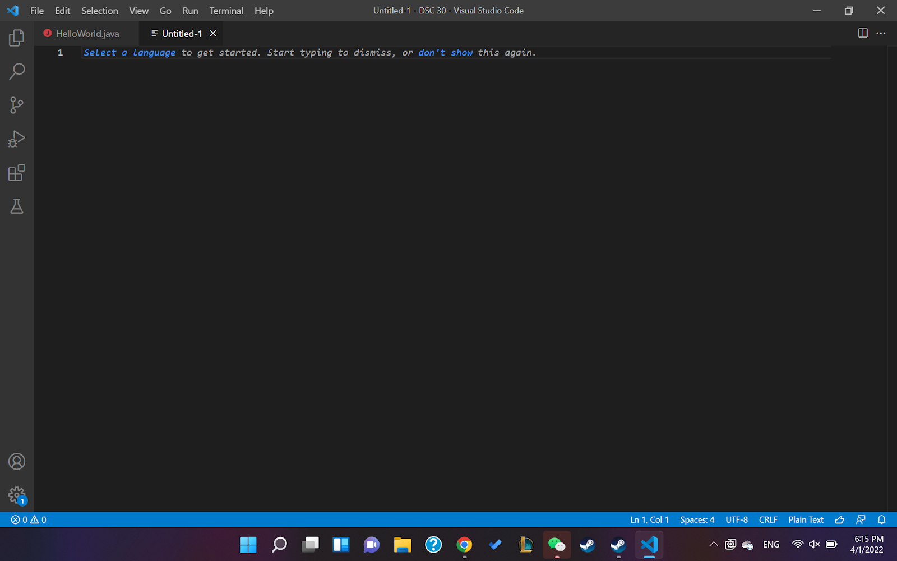
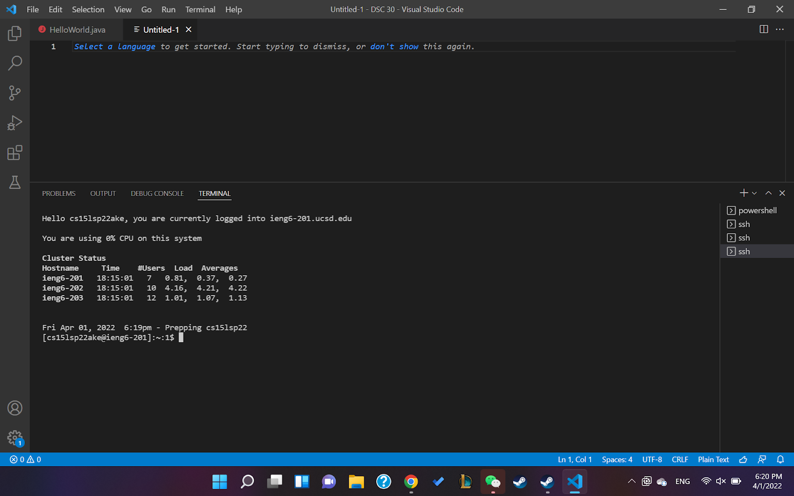
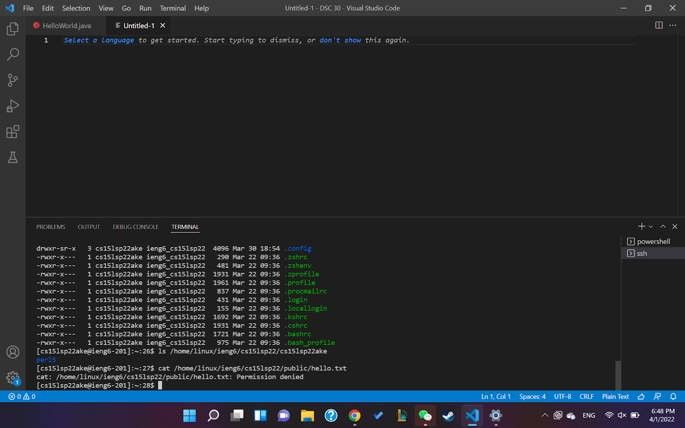
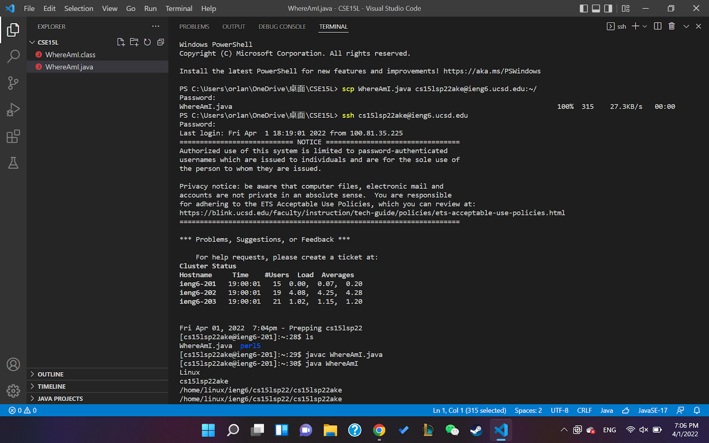
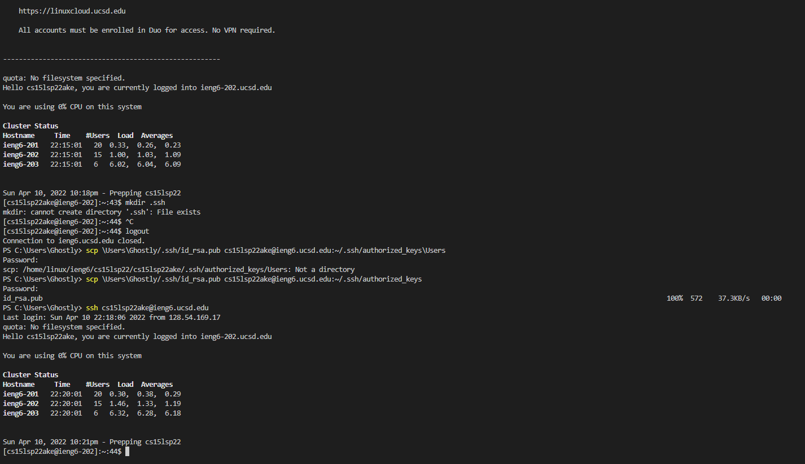
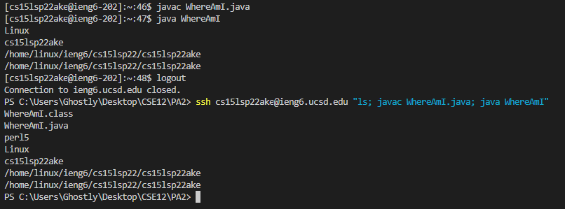

## CSE 15L Lab Report 1
## 1. Installing VScode
For installing VScode, I downloaded Visual Studio Code from the [offical website](https://code.visualstudio.com/). Then, I checked my java version to make sure I have the correct java version. Finally, I wrote a class that prints hello world and executed it to make sure everything works.



## 2. Remotely Connecting
First, I looked up for my username and changed my password for my cse15l account on the [school webstie](https://sdacs.ucsd.edu/~icc/index.php). Then, I opened a new terminal on VScode and entered ```ssh``` along with my usename. Next, I entered the new password and I was able to remotely connect to my cse15l account.



## 3. Trying Some Commands
There are multiple commands to try. The first command I tried was ```ls /home/linux/ieng6/cs15lsp22/cs15lsp22ake```, it demonstrates all files in my account’s directory. The second command I tried was ```/home/linux/ieng6/cs15lsp22/public/hello.txt```, which results in permission denied because I am tring to access a file that is not in my directory.



## 4. Moving Files with scp
After creating a java file WhereAmI.java, I saved my file and entered scp in my terminal. The format is ```scp filename.java username:~/```. Then, I enter my password, and the file was successfully moved to my account. When I enter ``ls`` after I login to my account, WhereAmI.java showed up.



## 5. Setting an SSH Key
First, on your computer (not on the server of the remote account), open a terminal and enter ```ssh-keygen```. Then, press the enter key 3 times. After the terminal generates the key fingerprint and key image, login in to the remote account and enter ```mkdir .ssh```. Next, logout by pressing ctrl+d and enter the following in the terminal: ```scp /Users/<user-name>/.ssh/id_rsa.pub cs15lsp22@ieng6.ucsd.edu:~/.ssh/authorized_keys```, where you replace <user-name> with your computer's name and change the remote account name to your own. Finally, you can access your remote account without entering password.
  

  
## 6. Optimizing Remote Running
Now since you already set an ssh key, you can directly run commands on your remote account by adding commanding inside quotation marks "" after entering ssh and account. You can also seperate commands by semicolons to process different commands in one line. 
In the picture below, the example is ```ssh cs15lsp22ake@ieng6.ucsd.edu "ls; javac WhereAmI.java; java WhereAmI"```. Within one line, I accessed by remote account,  list my home directory on the remote server, and compiled the java file WhereAmI. Being able to enter multiple commands in one line largely shortens the time. In the past to do this I need to enter 4 different lines of code but now I can fit this in one line, which saved me work and time.
  

