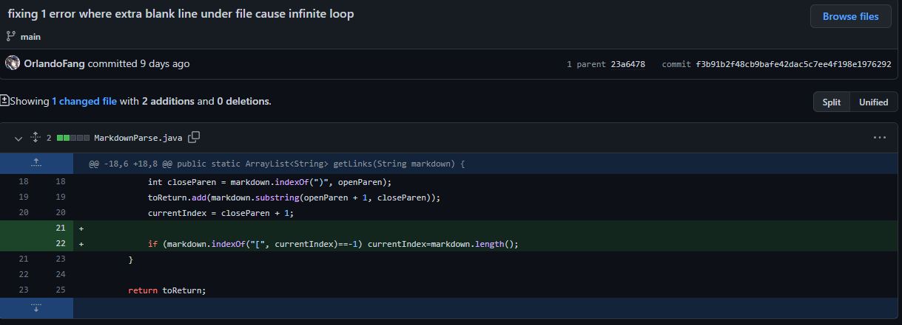
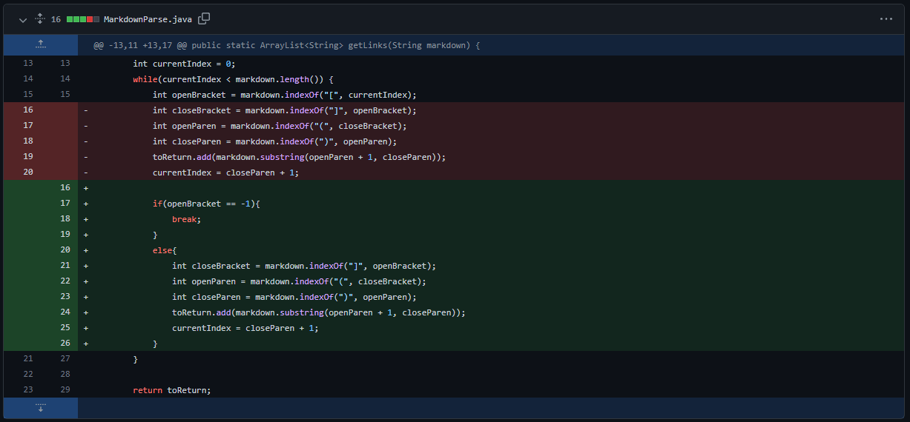
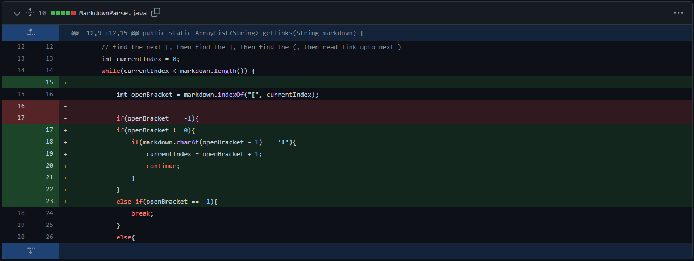
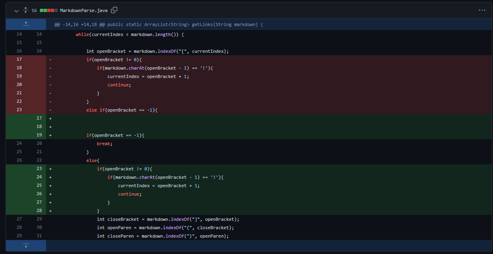

## Lab Report 2
## 1st Code Change

Output: ```Exception in thread "main" java.lang.OutOfMemoryError: Java heap space```
Link to test file: [test-file](https://orlandofang.github.io/cse15l-lab-reports/test-file.html) 

We first use print statements to find out that the value of the current index is kept repeating and always smaller than the length of the markdown file. 
We realized that our test file has a extra black line under the last link. This led to a bug where the current index will never exceed the length. This bug cause the while loop to become an infinite loop, and eventually cause the symptom of the out of memory error because too many times the loop was executed. 
So we added a if statement that ends the loop when there are no more brackets in the file.

## 2nd Code Change

Output: ```Exception in thread "main" java.lang.StringIndexOutOfBoundsException: Range [0, -1) out of bounds for length 5```
Link to test file: [empty](https://orlandofang.github.io/cse15l-lab-reports/empty.html) 

The second test case we found that causes an error is when we try the file with text, but no link. We realized that if we simply add an if statement at the end of the program will still cause an error because when the bracket does not exist but some text exists in the file, the while loop will go on and try to execute the substring statement. Thus, indexes of “0” and “-1” will be the arguments of the substring statement and make the statement cause an error. So we change the if statement to the next line of the initialization of openBracket: one the openBracket cannot be found, then the while loop will immediately break. 

## 3rd Code Change


Output: ```[somelink.html, someotherlink.html]```
Link to test file: [somelink](https://orlandofang.github.io/cse15l-lab-reports/somelink.html) 

In the third test case we changed one of the links of the url to an image, but the link of the image is still being outputted. We traced the code and found out the bug where method only looks for the brackets. This causes the method to ignore the exclamation mark in front of the brackets and print it as if it is a normal link, which was the symptom. To solve this issue we added another if statement that checks if there exists an exclamation mark in front of the first brackets.
