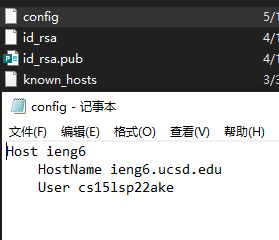
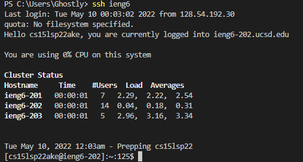
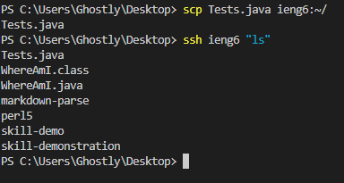
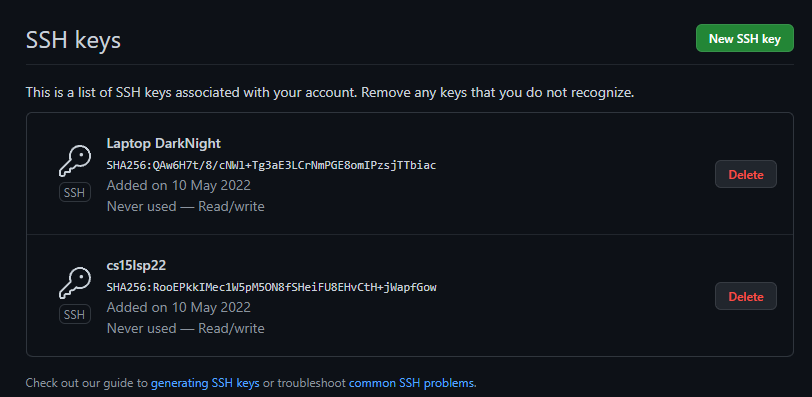
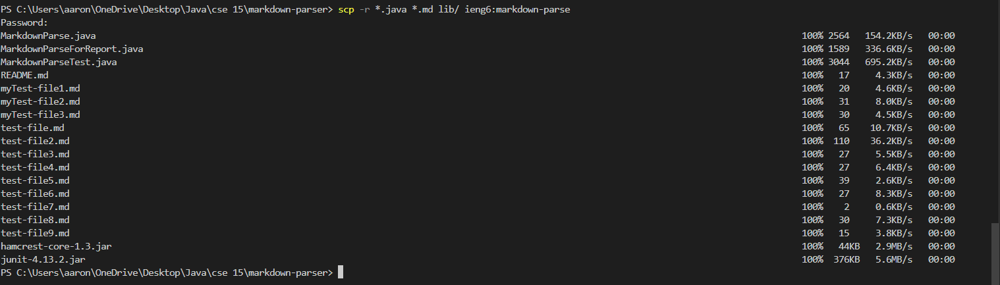
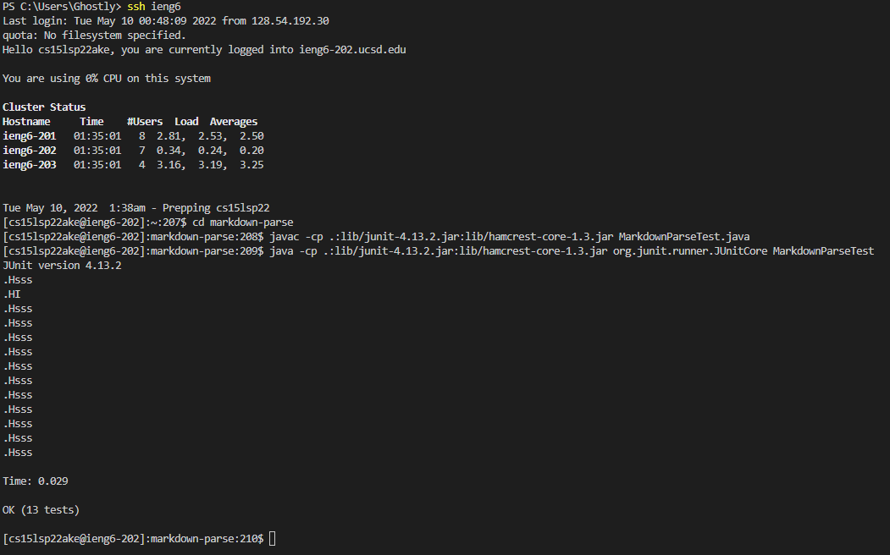
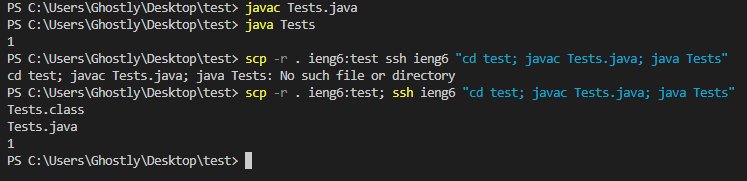

## Lab Report 2
## Streamlining ssh Configuration


I first created a nex txt file called config, then I entered the above text into the text file. After saving the file, I deleted the filename extention(.txt).


Next, i entered the code ```ssh ieng6``` on my terminal and I am able to access my remote account without entering my username.


Now, I can directly copy a local file to my remove account by replacing my username with the alias ```ieng6```.

## Setup Github Access from ieng6



I generated and stored my public key in my account and my github ssh keys.
Both the private key and the public key are stored in the .ssh file of my account.

## Copy whole directories with ```scp -r```


First, I enter ```scp -r *.java *.md lib/ ieng6:markdown-parse``` and copied the markdown-parse directory into my account.


After coping the markdown-parse into my account, I can run tests on my remote account using commands:
```javac -cp .:lib/junit-4.13.2.jar:lib/hamcrest-core-1.3.jar MarkdownParseTest.java```
```java -cp .:lib/junit-4.13.2.jar:lib/hamcrest-core-1.3.jar org.junit.runner.JUnitCore MarkdownParseTest```


Now I can copy a local directory to my account and run the tests in one line using the command ```scp -r . ieng6:test; ssh ieng6 "cd test; javac Tests.java; java Tests"```.
