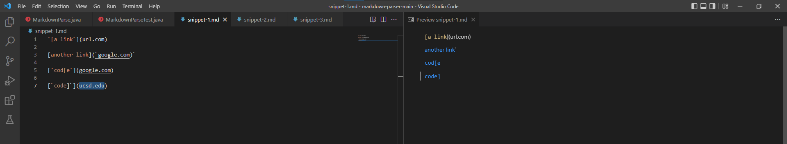
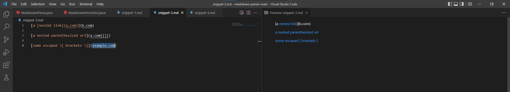
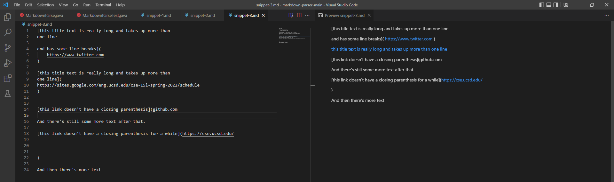
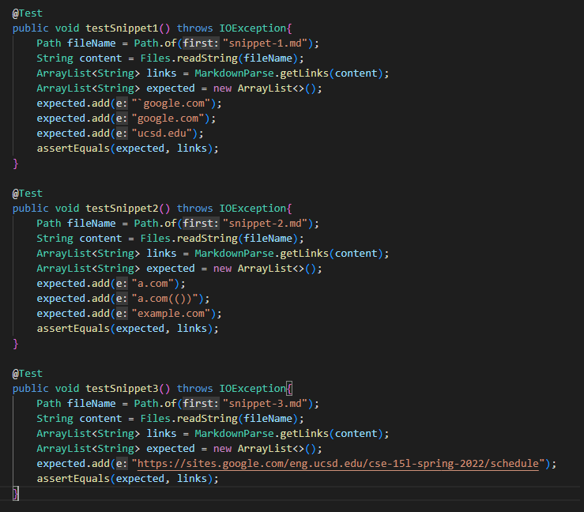
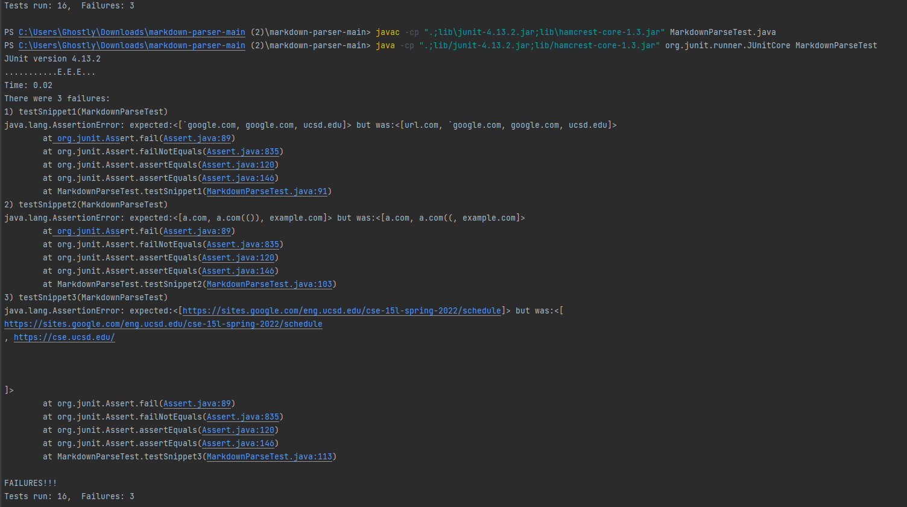
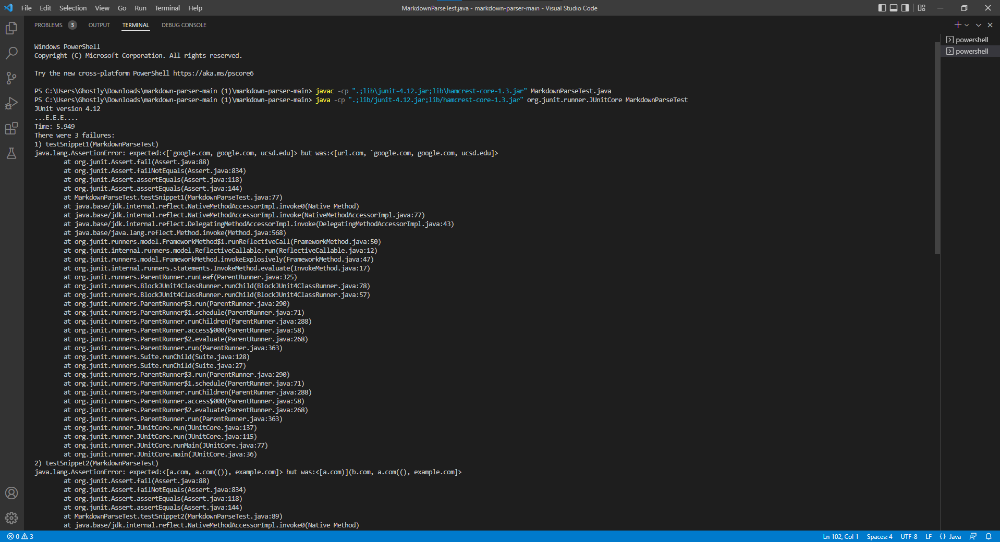
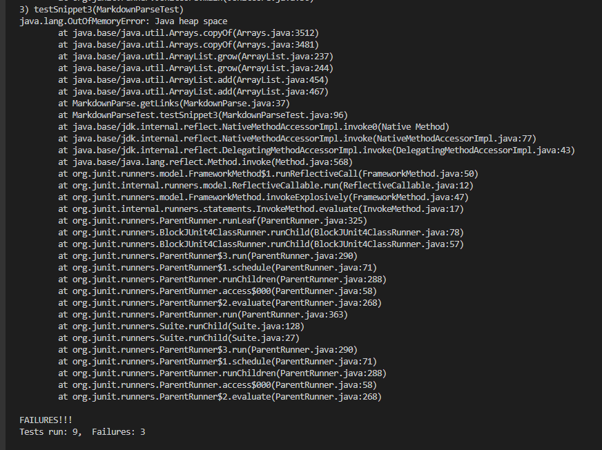

##Lab Report 4

##Links to repositories:
[myRepository](https://github.com/OrlandoFang/markdown-parser)
[reviewedRepository](https://github.com/alixintong/markdown-parser)

##Expected Output:



As the preview in VSCode shown, in snippet1 the first link is not a valid link, so the expected output for snippet 1 should be ```[`google.com, google.com, ucsd.edu]```.



As the preview in VSCode shown, in snippet2 ```a.com```became a link with the name ```nested link```, but ```b.com``` is not a valid link, so the expected output should be ```[a.com, a.com(()), example.com]```.



As the preview in VSCode shown, in snippet3 only the link with the name ```this title text is really long and takes up more than one line``` is a valid link. The other two links that are mark blue failed to relate to its name, so they are not valid. The expected output should be ```[https://sites.google.com/eng.ucsd.edu/cse-15l-spring-2022/schedule]```.

##Running Tests:

After finding the expected outputs, I added 3 tests in MarkdownParseTest.java.



For my implementation of MarkdownParse, all three tests failed.



For the implementation I reviewed, all three tests also failed.




##Question Responses:

1. I think a small code change can make my program work for snippet 1 and all related cases that use inline code with backticks. 
To fix this error, I would add a if statement check if there exist one backtick right before the open bracket. If there exist more than or less than one backtick then the link would be valid, if not the link would be invalid.

2. I think a small code change will not be enough to make my program work for snippet 2 and all related cases that nest parentheses, brackets, and escaped brackets.
My current MarkdownParse implementation catches link within an open parentheses and a close parentheses. To fix the error caused by nested parentheses, I will need to change my implementation completely using stack or queue so that my output link will not stop at the first close parentheses, and this required a large code change.

3. I think a small code change can make my program work for snippet 3 and all related cases that have newlines in brackets and parentheses.
To fix this error, after find the open parentheses or open brackets, I would search for new lines within the open parentheses/bracket and the close parentheses/bracket. If there exist more than one new line after the open parentheses/bracket or before the close parentheses/bracket, then the link would be invalid.
