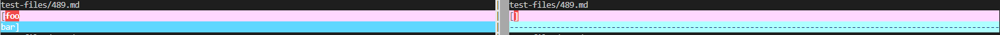

## Lab report 5
## Link to test files
[test files](https://github.com/nidhidhamnani/markdown-parser/tree/main/test-files)

## Find differences
I used vimdiff on the results of running a bash for loop.

## Difference 1
For the test on test file 489.md, my implementation gave the wrong output and the provided implementation gave the correct output.

Actual outputs: Result of my implementation is on left, provided implementation's result is on right


Expected output is that there is no valid link


Finding Bug:


The bug is that the method does not check if there exist new lines between brackets and parentheses, so my implementation assumed that this link is valid as long as there exist a open parentheses and a close parentheses.
To fix this bug, before the line ```int closeParen = markdown.indexOf(")", openParen);``` i should add a if statements that checks if there exist a new line ```"\n"``` between the open and close parentheses.

